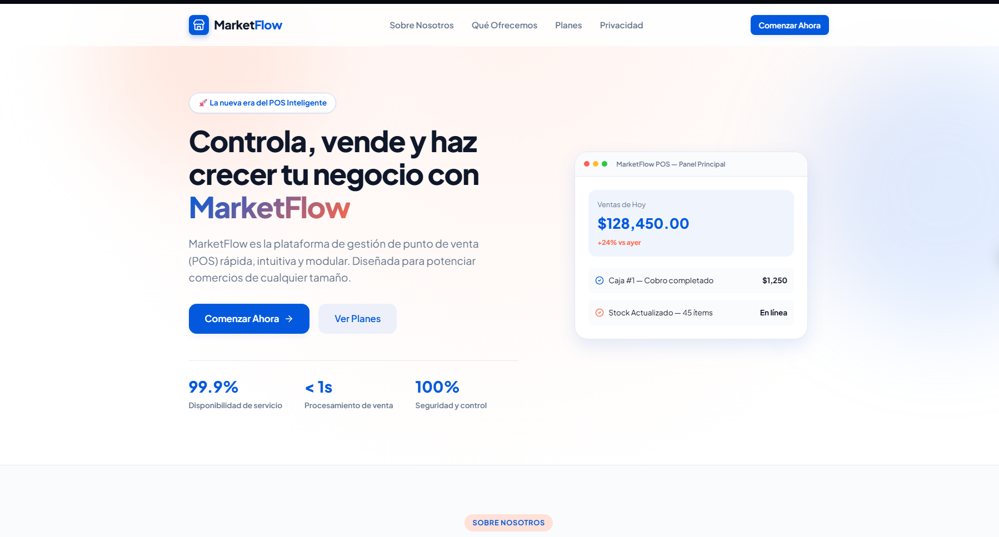
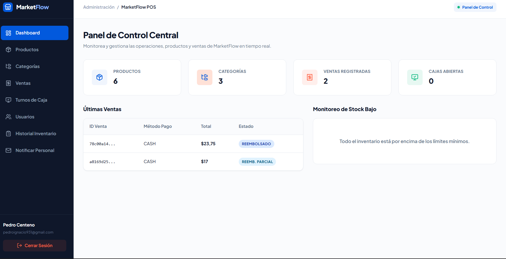

# 🛒 Marketflow

> **Un sistema backend y plataforma web moderna para la gestión dinámica y optimizada de operaciones de mercado.**

---

## 🌐 Demos en Vivo & Despliegue

El proyecto se encuentra totalmente desplegado y funcional en entornos de producción:

* 🎨 **Frontend App:** [Marketflow Web App](https://market-flow-theta.vercel.app) *(Desplegado en Vercel)*
* ⚙️ **Backend API:** [Marketflow API Service](https://marketflow-x5ld.onrender.com) *(Desplegado en Render)*

> 🔒 *Nota: Por motivos de seguridad y propiedad intelectual, este repositorio funciona como una vitrina arquitectónica y técnica (Showcase). El código fuente principal se gestiona en un repositorio privado.*

---

## 📸 Vista Previa

| Cliente Web | Panel & Operaciones |
| :---: | :---: |
|  |  |

---

## 🛠️ Tech Stack & Arquitectura

### **Tech Stack**

* **Frontend:** React, TypeScript, Tailwind CSS
* **Backend:** Node.js, Express.js, TypeScript
* **Base de Datos & Servicios:** Supabase / PostgreSQL
* **DevOps & Hosting:** Vercel (Client App), Render (API Server)

### **Diagrama de Flujo de Datos**

```text
[ Cliente Web (Vercel) ] 
       │
       ▼ (HTTPS / API Client)
[ Express.js + TS Server (Render) ]
       │
       ▼ (Database Client / Auth)
[ Supabase / PostgreSQL ]
